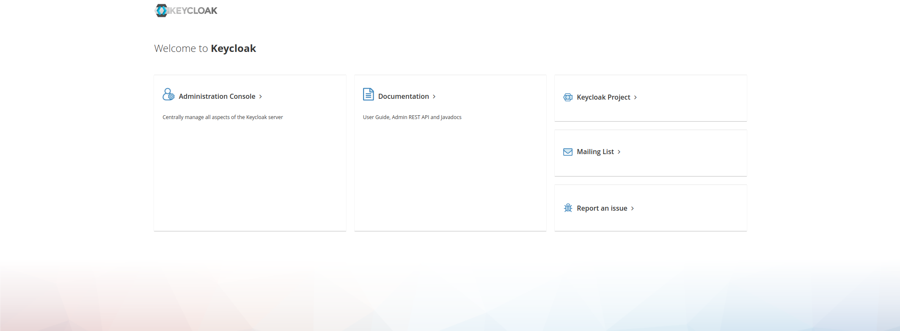
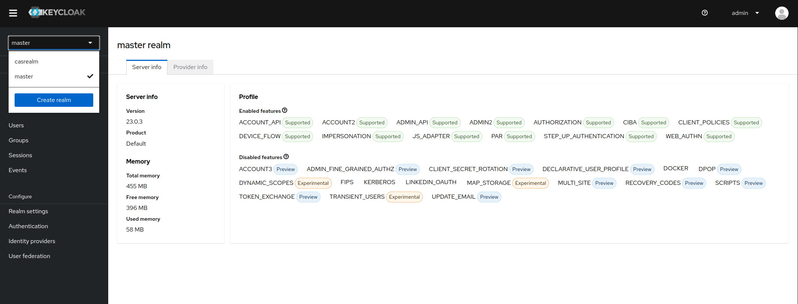
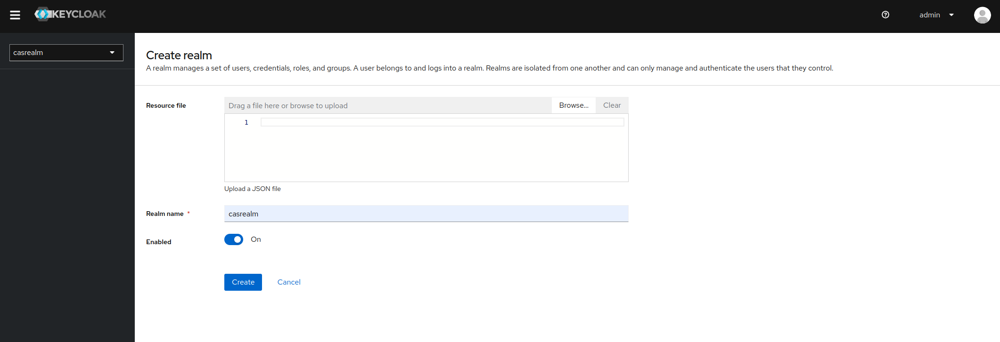
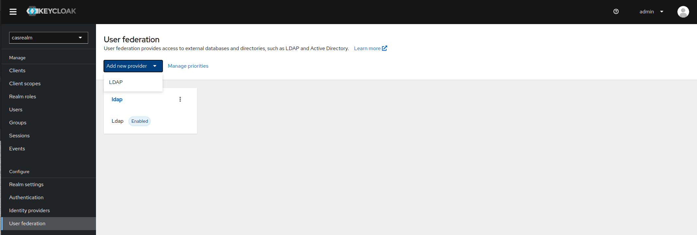
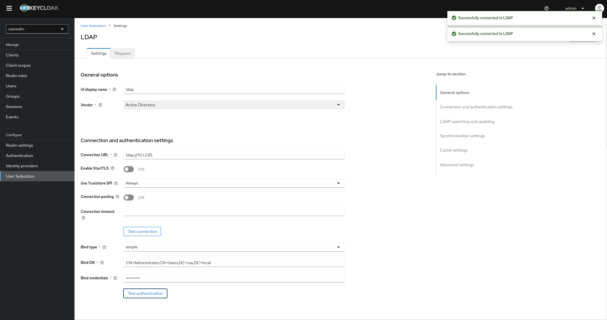
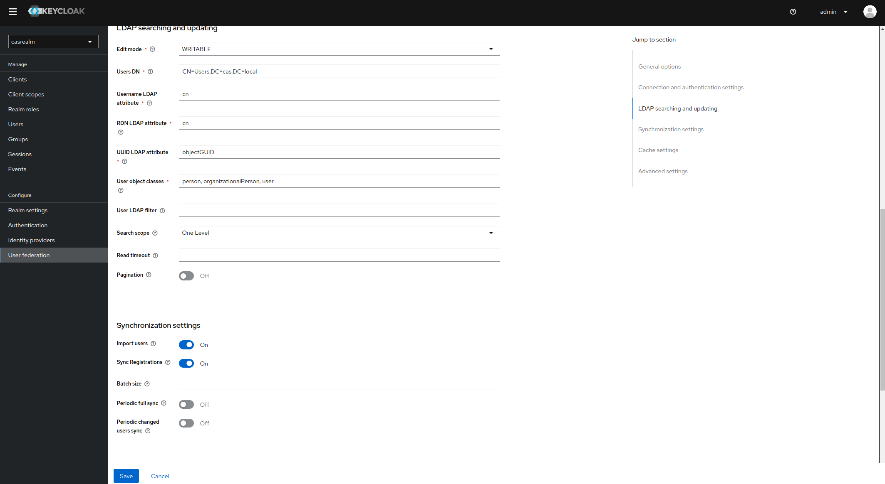

# Railhead Keycloak Project
This repository contains the code and configuration instructions for MFA to Microsoft's Active Directory via a Keycloak container deployed from podman. For additional details, please email at [christopher.sargent@sargentwalker.io](mailto:christopher.sargent@sargentwalker.io).

# Prerequisites
# [Download Windows Server 2022](https://go.microsoft.com/fwlink/p/?LinkID=2195167&clcid=0x409&culture=en-us&country=US)
# [Install Windows Server 2022 Instructions](https://medium.com/@yasithkumara/creating-a-virtual-windows-server-in-windows-10-with-hyper-v-9f3bd58c0ba)
# [Active Directory Install Instructions](https://medium.com/@yasithkumara/how-to-create-a-domain-and-a-domain-controller-in-a-windows-server-2019-virtual-machine-e70587e2fbe2)
# [Ubuntu 20.04 STIG Hardened FIPS Enabled](https://docs.google.com/document/d/1nEIavbELGl8xjHjZX4p22q5m32HCLkLH/edit#heading=h.gjdgxs)
* Take post set up snapshot on all servers 
* Create cas.local domain 

# Test VMs
* 10.1.2.85 AD server
* 10.1.2.86 keycloak01
* 10.1.2.87 keycloak02

# Install Keycloak via [podman](https://docs.podman.io/en/stable/Introduction.html)
* Note podman is in the default Ubuntu 22.04 repos but not Ubuntu 20.04
1. ssh cas@10.1.2.86
2. sudo -i 
3. apt install software-properties-common uidmap
4. sh -c "echo 'deb http://download.opensuse.org/repositories/devel:/kubic:/libcontainers:/stable/xUbuntu_20.04/ /' > /etc/apt/sources.list.d/devel:kubic:libcontainers:stable.list"
5. apt update 
6. apt-key adv --keyserver hkp://keyserver.ubuntu.com:80 --recv-keys 4D64390375060AA4
```
Executing: /tmp/apt-key-gpghome.NKPCfh5qZD/gpg.1.sh --keyserver hkp://keyserver.ubuntu.com:80 --recv-keys 4D64390375060AA4
gpg: out of core handler ignored in FIPS mode
gpg: key 4D64390375060AA4: public key "devel:kubic OBS Project <devel:kubic@build.opensuse.org>" imported
gpg: Total number processed: 1
gpg:               imported: 1
gpg: out of core handler ignored in FIPS mode

```
7. apt update 
8. apt install podman -y 
9. podman version
```
Version:      3.4.2
API Version:  3.4.2
Go Version:   go1.15.2
Built:        Thu Jan  1 00:00:00 1970
OS/Arch:      linux/amd64
```
10. mkdir keycloak && cd keycloak 
11. apt install python3-pip -y 
12. pip3 install podman-compose
13. apt install git -y && git init 
14. git add .
15. vim keycloak.yml 
```
version: '3'

volumes:
  postgres_data:
      driver: local

services:
  postgres:
      image: postgres
      volumes:
        - ./postgres_data:/var/lib/postgresql/data
      environment:
        POSTGRES_DB: keycloak
        POSTGRES_USER: keycloak
        POSTGRES_PASSWORD: password
  keycloak:
      image: quay.io/keycloak/keycloak:latest
      environment:
        DB_VENDOR: POSTGRES
        DB_ADDR: postgres
        DB_DATABASE: keycloak
        DB_USER: keycloak
        DB_SCHEMA: public
        DB_PASSWORD: password
        KEYCLOAK_ADMIN: admin
        KEYCLOAK_ADMIN_PASSWORD: 31Nst31n!40
#        KEYCLOAK_USER: admin
#        KEYCLOAK_PASSWORD: Pa55w0rd
        PROXY_ADDRESS_FORWARDING: 'true'
        # Uncomment the line below if you want to specify JDBC parameters. The parameter below is just an example, and it shouldn't be used in production without knowledge. It is highly recommended that you read the PostgreSQL JDBC driver documentation in order to use it.
        #JDBC_PARAMS: "ssl=true"
      ports:
        - 8010:8080
      depends_on:
        - postgres
      command:
      - start-dev

```
16. podman-compose -f keycloak.yml up -d
* podman logs -t keycloak_keycloak_1 
17. podman ps 
```
CONTAINER ID  IMAGE                              COMMAND     CREATED       STATUS           PORTS                   NAMES
d66e2c48c89d  docker.io/library/postgres:latest  postgres    24 hours ago  Up 24 hours ago                          keycloak_postgres_1
de0bbe48c12d  quay.io/keycloak/keycloak:latest   start-dev   24 hours ago  Up 23 hours ago  0.0.0.0:8010->8080/tcp  keycloak_keycloak_1

```
18. podman stats
```
ID            NAME                 CPU %       MEM USAGE / LIMIT  MEM %       NET IO             BLOCK IO      PIDS        CPU TIME         AVG CPU %
d66e2c48c89d  keycloak_postgres_1  0.01%       74.49MB / 8.331GB  0.89%       2.642kB / 15.75kB  0B / 68.83MB  6           42.379118819s    0.00%
de0bbe48c12d  keycloak_keycloak_1  0.50%       544.4MB / 8.331GB  6.53%       205.3MB / 2.498MB  0B / 27.14MB  53          9m28.123792396s  0.39%
```
19. http://10.1.2.86:8010/ select admin console 




# Create new Keycloak realm
1. http://10.1.2.86:8010/admin/master/console/


2. Select the master realm box and then select Create realm.



3. Fill out Realm name and toggle to Enabled and then select Create.



# Configure AD for user Federation via Keycloak
1. http://10.1.2.86:8010/admin/master/console/


2. Select User federation and then select Add new provider and select LDAP.



3. Populate Connection and authentication fields.
* UI display name = ldap
* Vender = Active Directory
* Connection URL = ldap://adserverip
* User Truststore SPI = Always
* Bind type = simple
* Bind DN = CN=Administrator,CN=Users,DC=cas,DC=local
* Bind credentials = AD administrator account or specific LDAP account for AD
* Test connection and Test authentication 
* Save



4. Populate LDAP searching and updating fields.
* Edit mode = READ_ONLY or WRITABLE 
* Users DN = CN=Users,DC=cas,DC=local
* Username LDAP attribute = cn
* RDN LDAP attribute = cn
* UUID LDAP attribute = objectGUID
* User object classes = person, organizationalPerson, user
* Search scope = One Level
* Import uses = toggle on
* Sync Registrations = toggle on
* Save



# Notes
```
podman exec -it keycloak_keycloak_1 bash
cd /opt/keycloak/bin
./kc.sh build --features="preview"
exit 
podman restart keycloak_keycloak_1 
```